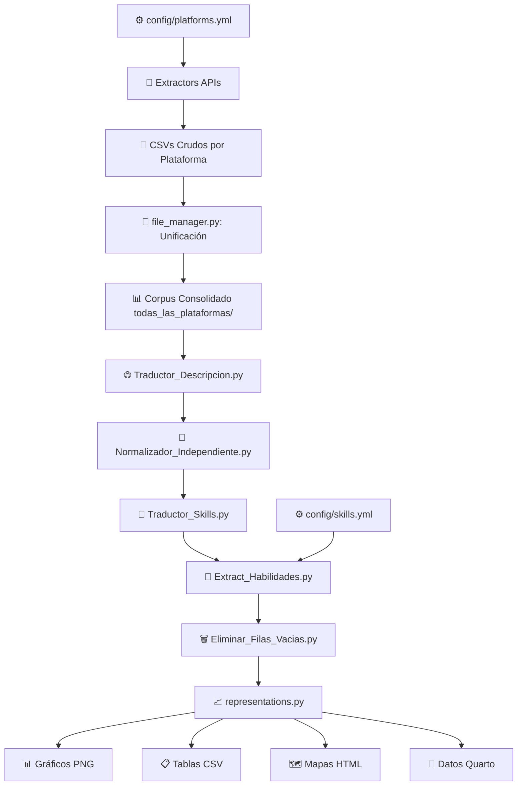

# 🎯 Sistema de Extracción de Ofertas Laborales para Análisis de Habilidades Blandas

[](https://python.org)
[]()
[]()

## 📋 Descripción General

Sistema **automatizado, escalable y trazable** para la extracción masiva de ofertas laborales desde múltiples plataformas de empleo. Los datos se clasifican por **carrera universitaria** y se procesan para análisis posteriores de **habilidades blandas** mediante técnicas de NLP y el framework **EURACE**.

### ✨ Características Principales

- 🔄 **Extracción automatizada** desde 2 plataformas principales (Jooble y LinkedIn)
- 📊 **Esquema unificado** de datos para análisis consistente  
- 🎯 **Clasificación por carreras** universitarias
- 🔍 **Detección de habilidades blandas** basada en EURACE
- 📝 **Sistema de logs** para trazabilidad completa
- 🌐 **Traducción automática** español/inglés
- 📈 **Generación de reportes** y visualizaciones

---

## 🏗️ Arquitectura y Estructura del Sistema

### 📂 Estructura de Directorios

```
modelo-ciencia-datos-empleabilidad/
│
├── 🎮 main.py                           # Punto de entrada principal del sistema
├── 📋 README.md                         # Documentación del proyecto
├── 📦 env_tic_requirements.txt          # Dependencias del proyecto
│
├── ⚙️ config/                           # Configuraciones del sistema
│   ├── platforms.yml                    # APIs, claves y términos de búsqueda por carrera
│   └── skills.yml                       # Diccionario de habilidades blandas EURACE
│
├── 🔌 extractors/                       # Módulos de extracción por plataforma
│   ├── jooble_api.py                   # Extractor para Jooble API
│   ├── rapidapi_api_1.py               # Extractor para JSSearch (RapidAPI)
│   ├── rapidapi_api_2.py               # Extractor para LinkedIn (RapidAPI)
│   └── coresignal_api.py               # Extractor para Coresignal API
│
├── 🛠️ utils/                            # Scripts de procesamiento y análisis
│   ├── file_manager.py                 # Gestión de archivos, logs y unificación de corpus
│   ├── Extract_Habilidades.py          # Extractor de habilidades blandas (EURACE)
│   ├── Traductor_Descripcion.py        # Traducción de descripciones de trabajos
│   ├── Traductor_Skills.py             # Traducción de habilidades técnicas
│   ├── Normalizador_Independiente.py   # Limpieza y normalización de texto
│   ├── Eliminar_Filas_Vacias.py        # Eliminación de registros sin contenido
│   ├── representations.py              # Generación de reportes y visualizaciones
│   ├── chart_generator.py              # Generador de gráficos y tablas (usado por representations.py)
│   └── location_extractor.py           # Extractor de ubicaciones geográficas
│
├── 📊 data/                             # Almacenamiento de datos
│   └── outputs/                         # Resultados de las extracciones
│       ├── jooble/                     # Trabajos extraídos desde Jooble
│       │   └── [Carrera]/              # Organizados por carrera universitaria
│       │       ├── YYYY-MM-DD/         # Extracciones por fecha
│       │       └── corpus_unido/       # Archivos consolidados por carrera
│       ├── rapidapi1/                  # Trabajos desde JSSearch (RapidAPI)
│       │   └── [Carrera]/
│       ├── rapidapi2/                  # Trabajos desde LinkedIn (RapidAPI)
│       │   └── [Carrera]/
│       ├── coresignal/                 # Trabajos desde Coresignal
│       │   └── [Carrera]/
│       ├── todas_las_plataformas/      # Corpus unificado de todas las fuentes
│       │   └── [Carrera]/              # Por carrera, incluye:
│       │       └── [Carrera]_Merged.csv # Trabajos consolidados
│       │       ├── habilidades_blandas_[Carrera].csv
│       │       └── análisis_[Carrera].csv
│       └── reportes/                   # Análisis y visualizaciones
│           ├── career_distribution.png # Gráfico de distribución por carreras
│           ├── platform_vs_career_stacked.png # Gráfico de plataformas vs carreras
│           ├── region_share.png        # Gráfico de distribución regional
│           ├── top_countries.png       # Gráfico de top países
│           ├── mapa.html               # Mapa interactivo de ubicaciones
│           └── Quarto_View/            # Reportes Quarto
│               ├── ReporteQuarto.qmd   # Documento Quarto
│               ├── ReporteQuarto.html  # Reporte renderizado
│               ├── custom.css          # Estilos personalizados
│               └── Data/               # Datos para el reporte
│
├── 📋 logs/                             # Registro de extracciones
│   ├── jooble_log.json                 # Log de extracción Jooble
│   ├── rapidapi1_log.json              # Log de extracción RapidAPI 1
│   ├── rapidapi2_log.json              # Log de extracción RapidAPI 2
│   └── coresignal_log.json             # Log de extracción Coresignal
│
└── 🐍 env_dtic/                         # Entorno virtual de Python
    ├── Lib/site-packages/              # Paquetes instalados
    ├── Scripts/                        # Scripts de activación
    └── pyvenv.cfg                      # Configuración del entorno
```

---

### 📁 Descripción Detallada de Directorios

#### ⚙️ **config/** - Configuraciones del Sistema
Contiene las configuraciones centrales para el funcionamiento de los extractores y análisis:

- **`platforms.yml`**: Configuración de APIs y términos de búsqueda
  - Claves API para cada plataforma (Jooble, RapidAPI, Coresignal)
  - Términos de búsqueda específicos por carrera universitaria
  - Configuración de endpoints y parámetros de extracción
  - Estado de habilitación de cada plataforma

- **`skills.yml`**: Diccionario de habilidades blandas EURACE
  - Definiciones de 7 categorías principales de habilidades blandas
  - Términos canónicos y patrones regex para detección
  - Framework EURACE completo (275 líneas de definiciones)

#### 🔌 **extractors/** - Módulos de Extracción
Contiene la lógica de extracción de trabajos desde cada API:

- Implementación de conectores para cada plataforma
- Normalización de datos al esquema unificado
- Manejo de errores y reintentos
- Paginación y control de rate limits
- Generación de job_id únicos con SHA256

#### 🛠️ **utils/** - Scripts de Procesamiento
Scripts y herramientas necesarias para el tratamiento y análisis de datos:

**Scripts del Pipeline Principal** (ejecución secuencial requerida):
1. **file_manager.py** - Gestión de archivos, logs y unificación de corpus
2. **Traductor_Descripcion.py** - Traducción de descripciones de trabajos
3. **Normalizador_Independiente.py** - Limpieza y normalización de texto
4. **Traductor_Skills.py** - Traducción de habilidades técnicas
5. **Extract_Habilidades.py** - Extracción de habilidades blandas (EURACE)
6. **Eliminar_Filas_Vacias.py** - Eliminación de registros sin contenido
7. **representations.py** - Generación de reportes y visualizaciones principales

**Scripts Complementarios** (opcionales, ejecutables independientemente):
- **chart_generator.py** - Generador de gráficos y tablas de análisis (usado por representations.py)
- **location_extractor.py** - Extracción y análisis avanzado de ubicaciones geográficas
- **Análisis geográfico**: Extracción y análisis de ubicaciones

#### 📊 **data/outputs/** - Almacenamiento de Datos

##### **Plataformas individuales** (`jooble/`, `rapidapi1/`, `rapidapi2/`, `coresignal/`)
Estructura por plataforma:
```
[plataforma]/
└── [Nombre_Carrera]/
    ├── [fecha1]/
    │   └── [plataforma]__[termino]__[fecha].csv
    ├── [fecha2]/
    │   └── [plataforma]__[termino]__[fecha].csv
    └── corpus_unido/
        └── [plataforma]__[Carrera]__[fecha]__merged.csv
```
- Organizados por carrera universitaria
- Subdirectorios por fecha de extracción
- Archivo unificado en `corpus_unido/` consolidando todas las fechas

##### **todas_las_plataformas/** - Corpus Consolidado Final
```
todas_las_plataformas/
└── [Nombre_Carrera]/
    ├── [Carrera]_Merged.csv                    # Trabajos de todas las plataformas
    ├── habilidades_blandas_[Carrera].csv       # Análisis de soft skills
    ├── habilidades_tecnicas_[Carrera].csv      # Análisis de hard skills
    └── analisis_locaciones_[Carrera].csv       # Distribución geográfica
```
- **Propósito**: Corpus final unificado de todas las fuentes
- Consolidación de trabajos de múltiples plataformas
- Datos ya procesados y listos para análisis
- Organizado por carrera universitaria

##### **reportes/** - Análisis y Visualizaciones
```
reportes/
├── career_distribution.png              # Distribución de ofertas por carrera
├── platform_vs_career_stacked.png       # Distribución de plataformas vs carreras
├── region_share.png                     # Participación por región
├── top_countries.png                    # Top países con más ofertas
├── mapa.html                            # Mapa interactivo de ubicaciones geográficas
└── Quarto_View/                         # Reportes Quarto
    ├── ReporteQuarto.qmd                # Documento fuente Quarto
    ├── ReporteQuarto.html               # Reporte renderizado en HTML
    ├── ReporteQuarto.pdf                # Reporte renderizado en PDF (si se genera)
    ├── custom.css                       # Estilos CSS personalizados
    ├── ReporteQuarto_files/             # Recursos generados automáticamente
    └── Data/                            # Datos para el reporte
        ├── career_stats.csv
        ├── platform_stats.csv
        ├── region_stats.csv
        └── top_countries.csv
```
- Generado por `representations.py` y otros scripts de análisis
- Contiene visualizaciones (PNG) y mapas interactivos (HTML)
- Tablas de análisis estadístico en formato CSV
- Contenido para generación de reportes con Quarto
- **Notas importantes**:
  - **Plataformas agrupadas**: LinkedIn consolida RapidAPI1, RapidAPI2 y CoreSignal
  - **Exclusión geográfica**: Estados Unidos se excluye del TOP países para enfoque regional
  - Los reportes Quarto aplican estos mismos filtros para consistencia en análisis

#### 📋 **logs/** - Registro de Extracciones
Mantiene el historial de extracciones por plataforma:

```json
{
  "ciencia de datos": {
    "last_extraction_date": "2025-09-23",
    "total_offers_extracted": 156,
    "last_page_extracted": 8
  }
}
```
- Fecha de última extracción por término de búsqueda
- Total de ofertas extraídas
- Última página procesada (para continuación)
- Control de duplicados y trazabilidad

#### 🐍 **env_dtic/** - Entorno Virtual de Python
Entorno virtual Python para desarrollo del proyecto:

- Aislamiento de dependencias del proyecto
- Contiene todas las librerías necesarias
- Configuración específica del proyecto
- Activación: `env_dtic\Scripts\activate` (Windows)

#### 📦 **env_tic_requirements.txt**
Lista completa de dependencias del proyecto:

- Versiones específicas de cada librería
- Reproducibilidad del entorno
- Instalación: `pip install -r env_tic_requirements.txt`

---

## 🔄 Pipeline de Procesamiento

### **Fase 1: Configuración y Extracción**

#### 🎯 **Plataformas Soportadas**
| Plataforma | APIs Utilizadas | Descripción | Estado |
|------------|----------------|-------------|--------|
| **Jooble** | Jooble API | Portal global de empleos | ✅ Activo |
| **LinkedIn** | RapidAPI 1, RapidAPI 2, CoreSignal | Datos profesionales de LinkedIn (agrupados) | ✅ Activo |

**Nota sobre LinkedIn**: Los datos de LinkedIn provienen de 3 fuentes diferentes (RapidAPI JSSearch, RapidAPI LinkedIn, CoreSignal) que se **agrupan como una sola plataforma** en los análisis y reportes finales para representar el ecosistema completo de LinkedIn.

#### 📋 **Carreras Configuradas** (24 carreras)
- Administración de Empresas, Agroindustria, Ciencia de Datos
- Computación, Inteligencia Artificial, Economía
- Ingenierías: Civil, Química, Ambiental, Mecánica, etc.
- Matemática, Física, Telecomunicaciones, Software

### **Fase 2: Normalización de Datos**

#### 🏗️ **Esquema Unificado**
Todas las plataformas se normalizan al siguiente esquema estándar:

| Campo | Tipo | Descripción |
|-------|------|-------------|
| `job_id` | String | Hash único MD5/SHA256 para deduplicación |
| `source` | String | Plataforma origen (jooble, rapidapi1, etc.) |
| `job_title` | String | Título del puesto de trabajo |
| `company` | String | Nombre de la empresa |
| `location` | String | Ubicación geográfica |
| `description` | Text | Descripción completa del puesto |
| `skills` | Array | Habilidades técnicas extraídas |
| `careers_required` | String | Carrera universitaria requerida |
| `date_posted` | Date | Fecha de publicación original |
| `url` | String | Enlace a la oferta original |
| `extraction_date` | Date | Fecha de extracción del sistema |

### **Fase 3: Pipeline de Procesamiento Secuencial**

El sistema implementa un **pipeline automatizado y secuencial** que transforma los datos crudos extraídos de las APIs en análisis estructurados y reportes visuales.

#### **📊 Flujo Completo del Pipeline**



#### **Origen de los Datos: Extractors**

Los **datos crudos** provienen de los módulos de extracción (`extractors/`) que consultan las APIs:
- `jooble_api.py` → `data/outputs/jooble/[Carrera]/`
- `rapidapi_api_1.py` → `data/outputs/rapidapi1/[Carrera]/` (LinkedIn - JSSearch)
- `rapidapi_api_2.py` → `data/outputs/rapidapi2/[Carrera]/` (LinkedIn - RapidAPI)
- `coresignal_api.py` → `data/outputs/coresignal/[Carrera]/` (LinkedIn - CoreSignal)

**📊 Agrupación en Análisis**: Las tres fuentes de LinkedIn (rapidapi1, rapidapi2, coresignal) se **consolidan como una sola plataforma "LinkedIn"** en los reportes y visualizaciones finales.

Estos archivos CSV contienen datos sin procesar con:
- Descripciones en idioma original (mayormente inglés)
- Habilidades técnicas sin normalizar
- Sin detección de habilidades blandas
- Ubicaciones sin procesar

#### **Consolidación Inicial (file_manager.py)**

Antes del pipeline de procesamiento, `file_manager.py` consolida los datos:
1. Lee archivos CSV de cada plataforma por carrera
2. Une múltiples fechas de extracción en un solo archivo
3. Genera `job_id` únicos para deduplicación
4. Crea corpus consolidado en `todas_las_plataformas/[Carrera]_Merged.csv`

#### **Pipeline de Transformación (6 Etapas)**

#### **Etapa 1: 🌐 Traducción de Descripciones**
**Archivo**: `Traductor_Descripcion.py`
- **Función**: Traduce descripciones completas de empleos al español
- **Características**:
  - Procesamiento por chunks de 4500 caracteres (límite API)
  - Control de errores con reintentos automáticos
  - Marcado de fallos: `[GT_FAIL]` para traducciones fallidas
  - Soporte multihilo (2-4 workers)
  - Limpieza previa: URLs, emails, HTML tags
- **Input**: `description` → **Output**: `description_final`

#### **Etapa 2: 🧹 Normalización de Texto**
**Archivo**: `Normalizador_Independiente.py`  
- **Función**: Limpia y normaliza el texto traducido
- **Procesos**:
  - ✂️ Elimina HTML, URLs, emails, emojis
  - 📝 Convierte viñetas y markdown a texto plano
  - 🔧 Corrige espacios y puntuación duplicada
  - 🌐 Elimina tags de idioma (`[SPANISH]`, `EN:`, etc.)
  - 📏 Colapsa separadores decorativos (`====`, `----`)
  - 🎯 Normaliza `Q&A` → `QA` (Quality Assurance)
- **Input**: `description_final` → **Output**: `description_final` (limpia)

#### **Etapa 3: 🔧 Traducción de Habilidades**
**Archivo**: `Traductor_Skills.py`
- **Función**: Traduce habilidades técnicas individuales al español
- **Características**:
  - Procesamiento de arrays: `["skill1", "skill2"]` → `"habilidad1, habilidad2"`
  - Cache global para evitar retraducciones
  - Control de reintentos por habilidad (3 intentos)
  - Multihilo con rate limiting
- **Input**: `skills` → **Output**: `skills` (en español)

#### **Etapa 4: 🧠 Extracción de Habilidades Blandas (EURACE)**
**Archivo**: `Extract_Habilidades.py`
- **Función**: Detecta habilidades blandas según framework EURACE
- **Categorías EURACE** (7 principales):
  1. 📋 **Gestión** - Planificación, organización, gestión del tiempo
  2. 💬 **Comunicación efectiva** - Oral, escrita, presentaciones
  3. 👑 **Liderazgo** - Dirección de equipos, toma de decisiones
  4. 🤝 **Trabajo en equipo** - Colaboración, sinergia
  5. ⚖️ **Ética profesional** - Integridad, responsabilidad
  6. 🌍 **Responsabilidad social** - Impacto social, sostenibilidad
  7. 📚 **Aprendizaje autónomo** - Autoaprendizaje, adaptabilidad

- **Metodología de detección**:
  - ✅ **Búsqueda exacta**: Términos canónicos del diccionario
  - 🔍 **Patrones regex**: Expresiones complejas contextuales
  - 🎯 **Fuzzy matching**: rapidfuzz con umbral >90% similitud
- **Fuentes**: `config/skills.yml` (275 líneas de definiciones)
- **Output**: `EURACE_skills`, `initial_skills`

#### **Etapa 5: 🗑️ Limpieza de Filas Vacías**
**Archivo**: `Eliminar_Filas_Vacias.py`
- **Función**: Elimina registros sin contenido útil
- **Criterios de eliminación**:
  - `description` vacía o solo espacios
  - `skills` vacías, `[]`, o `[   ]`
  - Combinación de ambas condiciones
- **Optimización**: Reduce tamaño de corpus hasta 30-40%

#### **Etapa 6: 📈 Generación de Reportes**
**Archivo**: `representations.py`
- **Función**: Crea visualizaciones y estadísticas finales
- **Outputs generados**:
  - 📊 Distribución por carreras (TOP 10)
  - 🌍 Análisis geográfico por países (TOP 15, **excluye Estados Unidos**)  
  - 💼 Habilidades más demandadas
  - 📊 Comparativa de plataformas (LinkedIn agrupa rapidapi1, rapidapi2, coresignal)
  - 📈 Tendencias temporales
  - 📋 Estadísticas descriptivas
- **Formatos**: PNG (gráficos) + CSV (datos tabulares)
- **Ubicación**: `data/outputs/reportes/`

---

## 🚀 Guía de Uso

### **Instalación**

1. **Clonar repositorio**:
```bash
git clone https://github.com/DilanAndrade007/modelo-ciencia-datos-empleabilidad.git
cd modelo-ciencia-datos-empleabilidad
```

2. **Configurar entorno virtual**:
```bash
# Windows
python -m venv env_dtic
env_dtic\Scripts\activate

# Linux/Mac
python3 -m venv env_dtic
source env_dtic/bin/activate
```

3. **Instalar dependencias**:
```bash
pip install -r env_tic_requirements.txt
```

4. **Configurar claves API** en `config/platforms.yml`:
```yaml
jooble:
  api_key: "TU_CLAVE_JOOBLE"
rapidapi1:
  api_key: "TU_CLAVE_RAPIDAPI"
# ... etc
```

### **Ejecución Principal - main.py**

El archivo **`main.py`** es el punto de entrada principal del sistema y orquesta todo el proceso de extracción:

```bash
python main.py
```

**Opciones disponibles en el menú interactivo**:
- `todas`: Ejecutar todas las plataformas habilitadas (Jooble, RapidAPI1, RapidAPI2, Coresignal)
- `jooble,rapidapi1`: Seleccionar plataformas específicas separadas por comas
- `unir`: Solo consolidar corpus existentes sin extraer nuevos datos
- `ninguna`: Salir sin ejecutar ninguna acción

**Funcionalidades de main.py**:
- Carga configuraciones desde `config/platforms.yml`
- Ejecuta extractores para cada plataforma habilitada
- Procesa múltiples carreras y términos de búsqueda
- Genera logs de trazabilidad en `logs/`
- Consolida datos en `data/outputs/`
- Manejo de errores y reintentos automáticos

### **Pipeline Completo de Procesamiento**

El sistema cuenta con un **pipeline automatizado de 6 etapas** para procesar los datos extraídos desde las APIs hasta obtener análisis completos.

#### **📥 Fase 1: Extracción de Datos (main.py)**
```bash
# Extracción desde todas las plataformas
python main.py
> todas

# O extracción selectiva
python main.py  
> jooble,rapidapi1,coresignal

# Solo consolidar corpus existentes
python main.py
> unir
```

**Resultado**: Archivos CSV organizados en `data/outputs/[plataforma]/[Carrera]/`

---

#### **🔄 Fase 2: Pipeline de Procesamiento Secuencial**

**⚠️ IMPORTANTE**: Ejecutar scripts en el orden indicado para garantizar resultados óptimos.

##### **Paso 1: 🌐 Traducción de Descripciones**
```bash
python utils/Traductor_Descripcion.py
```
- **Función**: Traduce descripciones completas de empleos al español
- **Características**:
  - Procesamiento por chunks de 4500 caracteres (límite API)
  - Control de errores con reintentos automáticos
  - Marcado de fallos: `[GT_FAIL]` para traducciones fallidas
  - Soporte multihilo (2-4 workers)
  - Limpieza previa: URLs, emails, HTML tags
- **Input**: `description` → **Output**: `description_final`

##### **Paso 2: 🧹 Normalización de Texto**
```bash
python utils/Normalizador_Independiente.py
```
- **Función**: Limpia y normaliza el texto traducido
- **Procesos**:
  - ✂️ Elimina HTML, URLs, emails, emojis
  - 📝 Convierte viñetas y markdown a texto plano
  - 🔧 Corrige espacios y puntuación duplicada
  - 🌐 Elimina tags de idioma (`[SPANISH]`, `EN:`, etc.)
  - 📏 Colapsa separadores decorativos (`====`, `----`)
  - 🎯 Normaliza `Q&A` → `QA` (Quality Assurance)
- **Input**: `description_final` → **Output**: `description_final` (limpia)

##### **Paso 3: 🔧 Traducción de Habilidades**
```bash
python utils/Traductor_Skills.py
```
- **Función**: Traduce habilidades técnicas individuales al español
- **Características**:
  - Procesamiento de arrays: `["skill1", "skill2"]` → `"habilidad1, habilidad2"`
  - Cache global para evitar retraducciones
  - Control de reintentos por habilidad (3 intentos)
  - Multihilo con rate limiting
- **Input**: `skills` → **Output**: `skills` (en español)

##### **Paso 4: 🧠 Extracción de Habilidades Blandas (EURACE)**
```bash
python utils/Extract_Habilidades.py
```
- **Función**: Detecta habilidades blandas según framework EURACE
- **Categorías EURACE** (7 principales):
  1. 📋 **Gestión** - Planificación, organización, gestión del tiempo
  2. 💬 **Comunicación efectiva** - Oral, escrita, presentaciones
  3. 👑 **Liderazgo** - Dirección de equipos, toma de decisiones
  4. 🤝 **Trabajo en equipo** - Colaboración, sinergia
  5. ⚖️ **Ética profesional** - Integridad, responsabilidad
  6. 🌍 **Responsabilidad social** - Impacto social, sostenibilidad
  7. 📚 **Aprendizaje autónomo** - Autoaprendizaje, adaptabilidad
- **Metodología de detección**:
  - ✅ **Búsqueda exacta**: Términos canónicos del diccionario
  - 🔍 **Patrones regex**: Expresiones complejas contextuales
  - 🎯 **Fuzzy matching**: rapidfuzz con umbral >90% similitud
- **Fuente**: `config/skills.yml` (275 líneas de definiciones)
- **Output**: Columnas `EURACE_skills`, `initial_skills`

##### **Paso 5: 🗑️ Limpieza de Filas Vacías**
```bash
python utils/Eliminar_Filas_Vacias.py
```
- **Función**: Elimina registros sin contenido útil
- **Criterios de eliminación**:
  - `description` vacía o solo espacios
  - `skills` vacías, `[]`, o `[   ]`
  - Combinación de ambas condiciones
- **Optimización**: Reduce tamaño de corpus hasta 30-40%

##### **Paso 6: 📈 Generación de Reportes**
```bash
python utils/representations.py
```
- **Función**: Crea visualizaciones y estadísticas finales
- **Outputs generados**:
  - 📊 Distribución por carreras (TOP 10)
  - 🌍 Análisis geográfico por países (TOP 15)  
  - 💼 Habilidades más demandadas
  - 📈 Tendencias temporales
  - 📋 Estadísticas descriptivas
- **Formatos**: PNG (gráficos) + CSV (datos tabulares)
- **Ubicación**: `data/outputs/reportes/`
- **⚠️ Notas importantes**: 
  - Las plataformas RapidAPI1, RapidAPI2 y CoreSignal se agrupan como **LinkedIn** en visualizaciones y reportes
  - **Estados Unidos se excluye** del análisis de TOP países para enfocarse en mercados regionales más relevantes
  - Los reportes Quarto aplican estos mismos filtros para consistencia

---

#### **⚡ Ejecución Automatizada Completa (PowerShell)**

Para ejecutar todo el pipeline de una vez:

```powershell
# Script completo en Windows PowerShell
python main.py; `
python utils/Traductor_Descripcion.py; `
python utils/Normalizador_Independiente.py; `
python utils/Traductor_Skills.py; `
python utils/Extract_Habilidades.py; `
python utils/Eliminar_Filas_Vacias.py; `
python utils/representations.py; `
Write-Host "✅ Pipeline completo ejecutado"
```

---

#### **🎯 Resultados del Pipeline**

Al finalizar el pipeline completo tendrás:

| Resultado | Descripción | Ubicación |
|-----------|-------------|-----------|
| 📊 **Corpus limpio** | Datos normalizados y deduplicados | `data/outputs/todas_las_plataformas/` |
| 🧠 **Skills detectadas** | Habilidades blandas categorizadas EURACE | Columnas `EURACE_skills`, `initial_skills` |
| 📈 **Reportes visuales** | Gráficos de distribución y tendencias | `data/outputs/reportes/imagenes/` |
| 📋 **Estadísticas** | Métricas descriptivas por carrera/país | `data/outputs/reportes/data/` |
| 🗺️ **Mapas interactivos** | Visualización geográfica HTML | `data/outputs/reportes/mapa.html` |
| 🗂️ **Datos listos** | Para análisis ML/NLP posteriores | Archivos `[Carrera]_Merged.csv` |

---

### **📄 Generación de Reportes con Quarto**

[Quarto](https://quarto.org/) es un sistema de publicación científica y técnica de código abierto que permite crear documentos dinámicos, reportes, presentaciones y sitios web combinando código, narrativa y visualizaciones.

#### **¿Qué es Quarto en este Proyecto?**

Quarto se utiliza para generar **reportes interactivos y profesionales** del análisis de empleabilidad, combinando:
- 📊 Análisis estadísticos del mercado laboral
- 📈 Visualizaciones dinámicas de habilidades demandadas
- 🌍 Mapas geográficos de distribución de empleos
- 📝 Narrativa académica y conclusiones

#### **Estructura de Quarto en el Proyecto**

Los archivos Quarto se encuentran en: `data/outputs/reportes/Quarto_View/`

```
Quarto_View/
├── ReporteQuarto.qmd            # Documento principal del reporte
├── custom.css                   # Estilos CSS personalizados
├── Data/                        # Datos procesados para el reporte
│   ├── career_stats.csv
│   ├── platform_stats.csv
│   ├── region_stats.csv
│   └── top_countries.csv
├── ReporteQuarto.html           # Reporte renderizado en HTML
└── ReporteQuarto_files/         # Recursos generados (imágenes, scripts)
```

#### **Instalación de Quarto**

1. **Descargar e instalar Quarto**:
   - Visitar [https://quarto.org/docs/get-started/](https://quarto.org/docs/get-started/)
   - Descargar el instalador para tu sistema operativo
   - Seguir instrucciones de instalación

2. **Verificar instalación**:
   ```powershell
   quarto --version
   ```

#### **Renderizar Reportes Quarto**

```powershell

# Renderizar a PDF (requiere tinytex o LaTeX instalado)
quarto render data\outputs\reportes\Quarto_View\ReporteQuarto.qmd --to pdf

# Previsualizar en el navegador 
quarto preview data\outputs\reportes\Quarto_View\ReporteQuarto.qmd --no-browser --no-watch-inputs
```

**Requisitos para PDF**:
- Instalar TinyTeX: `quarto install tinytex`
- O tener una distribución LaTeX completa (TeX Live, MiKTeX)

#### **Características del Reporte Quarto**

- ✅ **Datos filtrados**: Excluye Estados Unidos del TOP países para enfoque en mercados regionales
- 🔗 **Plataformas agrupadas**: LinkedIn consolida datos de RapidAPI1, RapidAPI2 y CoreSignal
- 📊 **Tablas interactivas**: Datos ordenables y filtrables
- 📈 **Gráficos dinámicos**: Visualizaciones con ggplot2 o plotly
- 🗺️ **Mapas embebidos**: Integración de visualizaciones geográficas
- 📄 **Formato profesional**: CSS personalizado para publicación académica
- 🔄 **Reproducible**: Regenerable con datos actualizados

#### **Personalización del Reporte**

Editar `ReporteQuarto.qmd` para:
- Agregar nuevas secciones de análisis
- Modificar visualizaciones existentes
- Incluir narrativa y conclusiones
- Integrar nuevas métricas

Editar `custom.css` para:
- Cambiar colores y tipografía
- Ajustar diseño y espaciado
- Personalizar estilos de tablas y gráficos

#### **Integración con el Pipeline**

El script `representations.py` genera automáticamente los datos necesarios para Quarto en formato CSV, listos para ser consumidos por los documentos `.qmd`.

---

## 🛠️ Archivos de Soporte y Configuración

### **📁 file_manager.py** - Gestor Central de Archivos
Utilidad transversal utilizada por múltiples componentes del pipeline:

**Funciones principales**:
- 📋 **Gestión de logs**: `guardar_log()`, `cargar_log_existente()`
- 🗂️ **Unificación de corpus**: `unir_corpus_por_carrera()`, `unir_corpus_acumulado_por_carrera()`
- 🎯 **Deduplicación inteligente**: Genera `job_id` únicos con SHA256
- 📅 **Normalización de fechas**: Convierte formatos diversos a `YYYY-MM-DD`
- 📖 **Lectura robusta**: Maneja diferentes encodings y separadores CSV

**Esquema de job_id único**:
```python
job_id = SHA256(job_title + company + location + date_posted_norm)
```

### **⚙️ config/skills.yml** - Diccionario de Habilidades Blandas
Archivo central con **275 líneas** de definiciones EURACE:

```yaml
categories:
  "Gestión":
    canonical:
      - "gestión del tiempo"
      - "planificación"  
      - "organización"
    patterns:
      - "\\bautomatizar\\s+procesos\\b"
      - "\\bgestion\\s+de\\s+proyectos?\\b"
      - "\\borientacion\\s+a\\s+resultados?\\b"
      
  "Comunicación efectiva":
    canonical:
      - "comunicación oral"
      - "redacción"
      - "presentaciones"
    patterns:
      - "\\bhabilidades\\s+comunicativas\\b"
      - "\\bcapacidad\\s+de\\s+comunicacion\\b"
```

**Estructura por categoría**:
- **canonical**: Términos exactos a buscar
- **patterns**: Expresiones regex contextuales
- **order**: Secuencia de prioridad en reportes

### **🎨 Utilidades Especializadas**

#### **Traductor_Original.ipynb**
- Notebook Jupyter con experimentos de traducción
- Pruebas de diferentes APIs y métodos
- Análisis de calidad de traducción

#### **pruebas/** - Directorio de Testing
- `buscar_ecuador.py`: Filtros geográficos específicos
- `merge_jobs.py`: Herramientas de consolidación manual
- `test.py`: Pruebas unitarias del sistema
- `trabajos_extraidos.csv`: Muestras de datos para validación

---

## �📊 Sistema de Trazabilidad

### **Logs de Extracción**
Cada plataforma mantiene un log detallado en `logs/`:

```json
{
  "ciencia de datos": {
    "last_extraction_date": "2025-09-23",
    "total_offers_extracted": 156,
    "last_page_extracted": 8
  },
  "machine learning": {
    "last_extraction_date": "2025-09-23", 
    "total_offers_extracted": 89,
    "last_page_extracted": 4
  }
}
```

### **Control de Duplicados**
- **job_id único**: Hash basado en título + empresa + ubicación + fecha
- **Deduplicación automática**: A nivel de archivo y corpus consolidado
- **Validación cruzada**: Entre plataformas y fechas

### **Estructura de Archivos**
```
data/outputs/
├── jooble/Ciencia_de_Datos/
│   ├── jooble__ciencia_de_datos__2025-09-23.csv
│   ├── jooble__machine_learning__2025-09-23.csv
│   └── corpus_unido/
│       └── jooble__Ciencia_de_Datos__2025-09-23__merged.csv
├── todas_las_plataformas/Ciencia_de_Datos/
│   ├── jooble__Ciencia_de_Datos__2025-09-23__merged.csv
│   ├── rapidapi1__Ciencia_de_Datos__2025-09-23__merged.csv
│   └── Ciencia_de_Datos_Merged.csv  # ← CORPUS FINAL
└── reportes/
    ├── distribucion_carreras.png
    ├── skills_mas_demandadas.png
    └── estadisticas_globales.csv
```

---

## ⚙️ Configuración Avanzada

### **Agregar Nueva Plataforma**

1. **Crear extractor** en `extractors/nueva_plataforma_api.py`:
```python
def extraer_desde_nueva_plataforma(query, api_key, carrera):
    # Implementar lógica de extracción
    # Normalizar al esquema estándar
    # Usar file_manager para logs
    pass
```

2. **Actualizar** `config/platforms.yml`:
```yaml
nueva_plataforma:
  enabled: true
  api_key: "TU_API_KEY"
  carreras:
    Ciencia de Datos:
      - data scientist
      - analista de datos
```

3. **Integrar** en `main.py`:
```python
from extractors.nueva_plataforma_api import extraer_desde_nueva_plataforma

def ejecutar_nueva_plataforma():
    # Implementar función ejecutora
    pass
```

### **Personalizar Habilidades Blandas**

Editar `config/skills.yml` para agregar nuevas categorías:

```yaml
categories:
  "Nueva Categoría":
    canonical:
      - "término exacto"
      - "otro término"
    patterns:
      - "\\bpatron\\s+regex\\b"
      - "\\botra\\s+expresion\\b"
```

---

## 📈 Casos de Uso

### **🎓 Investigación Académica**
- Análisis de demanda laboral por carrera universitaria
- Evolución temporal de habilidades requeridas
- Estudios longitudinales del mercado laboral
- Investigación sobre competencias del siglo XXI
- Publicaciones científicas sobre empleabilidad

### **🧭 Orientación Vocacional**
- Identificación de competencias más demandadas por sector
- Análisis de gaps entre formación académica y mercado
- Tendencias emergentes en perfiles profesionales
- Guías de desarrollo de carrera para estudiantes
- Recomendaciones personalizadas de habilidades a desarrollar

### **🏫 Políticas Educativas e Institucionales**
- Diseño de currículos basados en datos reales del mercado
- Evaluación de programas formativos universitarios
- Planificación estratégica institucional
- Identificación de necesidades de capacitación
- Desarrollo de programas de empleabilidad estudiantil

### **💼 Análisis Empresarial y Reclutamiento**
- Benchmarking de requisitos de contratación por industria
- Identificación de perfiles profesionales escasos
- Optimización de procesos de reclutamiento
- Análisis competitivo del mercado laboral
- Planificación de recursos humanos

### **📊 Análisis de Datos y Machine Learning**
- Dataset estructurado para modelos predictivos
- Análisis de NLP sobre descripciones de empleos
- Clasificación automática de ofertas laborales
- Extracción de insights con técnicas de text mining
- Desarrollo de sistemas de recomendación

---

## 🛠️ Tecnologías Utilizadas

| Categoría | Tecnologías |
|-----------|-------------|
| **Lenguaje** | Python 3.8+ |
| **APIs** | Jooble, RapidAPI (JSSearch, LinkedIn), Coresignal |
| **Procesamiento** | pandas, numpy, requests |
| **NLP** | deep-translator, rapidfuzz, regex |
| **Visualización** | matplotlib, seaborn |
| **Reportes** | Quarto (publicación científica y técnica) |
| **Formato** | CSV, JSON, YAML |

---

## 📝 Mantenimiento y Soporte

### **Logs de Errores**
Los errores se registran automáticamente con:
- Timestamp de ocurrencia
- Plataforma y término afectados
- Detalle del error y stack trace

### **Monitoreo de APIs**
- Control de rate limits
- Validación de respuestas
- Timeouts configurables
- Reintentos automáticos

### **Actualizaciones**
El sistema está diseñado para:
- Agregar nuevas plataformas fácilmente
- Modificar esquemas de normalización
- Extender categorías de habilidades
- Integrar nuevos métodos de análisis

---

## 🤝 Contribución

Este proyecto está abierto a contribuciones de la comunidad académica y profesional. Para contribuir:

### **Cómo Contribuir**

1. **Fork del repositorio**
   ```bash
   git clone https://github.com/DilanAndrade007/modelo-ciencia-datos-empleabilidad.git
   ```

2. **Crear rama de desarrollo**
   ```bash
   git checkout -b feature/nueva-funcionalidad
   ```

3. **Realizar cambios y commit**
   ```bash
   git add .
   git commit -m "Descripción de cambios"
   ```

4. **Push y Pull Request**
   ```bash
   git push origin feature/nueva-funcionalidad
   ```
   Luego crear Pull Request en GitHub

### **Áreas de Contribución**

- 🔌 **Nuevos extractores**: Agregar soporte para más plataformas de empleo
- 🧠 **Mejoras en NLP**: Optimizar detección de habilidades blandas
- 📊 **Visualizaciones**: Crear nuevos tipos de análisis y gráficos
- 🌐 **Internacionalización**: Soporte para más idiomas
- 📖 **Documentación**: Mejorar guías y tutoriales
- 🐛 **Corrección de bugs**: Reportar y corregir errores

### **Estándares de Código**

- Seguir PEP 8 para código Python
- Documentar funciones con docstrings
- Incluir pruebas para nuevas funcionalidades
- Actualizar README si se agregan características

---

## 📄 Licencia

Este proyecto está bajo licencia **MIT** - ver archivo [LICENSE](LICENSE) para detalles.

### Términos de Uso

- ✅ Uso comercial permitido
- ✅ Modificación permitida
- ✅ Distribución permitida
- ✅ Uso privado permitido
- ⚠️ Sin garantía

---

## 📞 Contacto y Soporte

### **Información de Contacto**

- **Autor**: Dilan Andrade
- **Email**: andradedilan24@gmail.com
- **Institución**: Escuela Politécnica Nacional
- **GitHub**: [@DilanAndrade007](https://github.com/DilanAndrade007)
- **Repositorio**: [modelo-ciencia-datos-empleabilidad](https://github.com/DilanAndrade007/modelo-ciencia-datos-empleabilidad)

### **Soporte Técnico**

Para preguntas, problemas técnicos o colaboraciones:

1. **Issues en GitHub**: [Crear nuevo issue](https://github.com/DilanAndrade007/modelo-ciencia-datos-empleabilidad/issues)
2. **Email directo**: andradedilan24@gmail.com
3. **Discusiones**: [Foro de discusiones](https://github.com/DilanAndrade007/modelo-ciencia-datos-empleabilidad/discussions)

### **Colaboraciones Académicas**

Abierto a colaboraciones en:
- Proyectos de investigación
- Publicaciones científicas
- Desarrollo de tesis y proyectos de titulación
- Workshops y capacitaciones

---

## 🙏 Agradecimientos

Este proyecto fue desarrollado como parte de investigaciones en empleabilidad y competencias profesionales en la **Escuela Politécnica Nacional**.

Agradecimientos especiales a:
- Profesores y mentores del área de Ciencia de Datos
- Comunidad open-source de Python
- Proveedores de APIs: Jooble, RapidAPI, Coresignal
- Framework EURACE para clasificación de habilidades blandas

---

## 📚 Referencias y Recursos

### **Framework EURACE**
- Clasificación de habilidades blandas basada en estándares europeos
- [Documentación oficial EURACE](https://eurace.org)

### **APIs Utilizadas**
- [Jooble API](https://jooble.org/api/about)
- [RapidAPI](https://rapidapi.com/)
- [Coresignal API](https://coresignal.com/)

### **Tecnologías y Librerías**
- [Python 3.8+](https://python.org)
- [Pandas](https://pandas.pydata.org/)
- [Deep Translator](https://deep-translator.readthedocs.io/)
- [RapidFuzz](https://maxbachmann.github.io/RapidFuzz/)
- [Quarto](https://quarto.org) - Sistema de publicación científica y técnica

---

<div align="center">

**⭐ Si este proyecto te fue útil, considera darle una estrella en GitHub ⭐**

[](https://github.com/DilanAndrade007/modelo-ciencia-datos-empleabilidad)

---

**Desarrollado con ❤️ para mejorar la empleabilidad profesional**

*Última actualización: Noviembre 2025*

</div>
