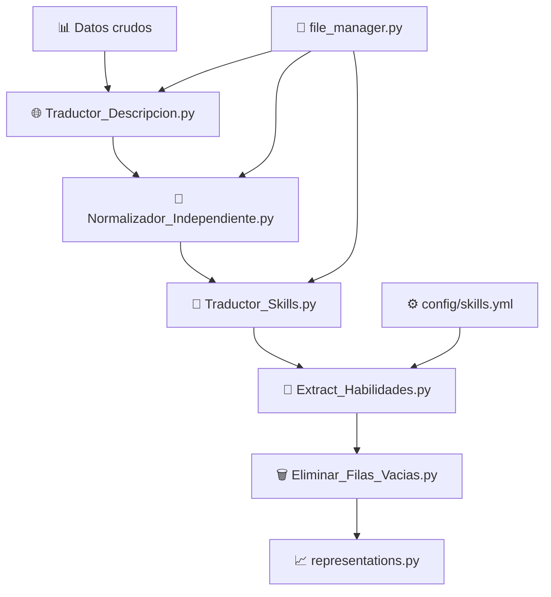

# 🎯 Sistema de Extracción de Ofertas Laborales para Análisis de Habilidades Blandas

[](https://python.org)
[]()
[]()

## 📋 Descripción General

Sistema **automatizado, escalable y trazable** para la extracción masiva de ofertas laborales desde múltiples plataformas de empleo. Los datos se clasifican por **carrera universitaria** y se procesan para análisis posteriores de **habilidades blandas** mediante técnicas de NLP y el framework **EURACE**.

### ✨ Características Principales

- 🔄 **Extracción automatizada** desde 4 plataformas principales
- 📊 **Esquema unificado** de datos para análisis consistente  
- 🎯 **Clasificación por carreras** universitarias
- 🔍 **Detección de habilidades blandas** basada en EURACE
- 📝 **Sistema de logs** para trazabilidad completa
- 🌐 **Traducción automática** español/inglés
- 📈 **Generación de reportes** y visualizaciones

---

## 🏗️ Arquitectura del Sistema

```
modelo-ciencia-datos-empleabilidad/
│
├── 🎮 main.py                      # Orquestador principal del sistema
│
├── ⚙️ config/
│   ├── platforms.yml               # Configuración APIs y términos por carrera
│   └── skills.yml                  # Diccionario de habilidades blandas EURACE
│
├── 🔌 extractors/                  # Módulos de extracción por plataforma
│   ├── jooble_api.py              # Extractor Jooble API
│   ├── rapidapi_api_1.py          # Extractor JSSearch (RapidAPI)
│   ├── rapidapi_api_2.py          # Extractor LinkedIn (RapidAPI)
│   └── coresignal_api.py          # Extractor Coresignal API
│
├── 🛠️ utils/                       # Herramientas de procesamiento
│   ├── file_manager.py            # Gestión de archivos y logs
│   ├── Extract_Habilidades.py     # Extractor de habilidades blandas
│   ├── Traductor_Descripcion.py   # Traductor de descripciones
│   ├── Traductor_Skills.py        # Traductor de habilidades
│   ├── representations.py         # Generador de reportes y gráficos
│   └── Normalizador_Independiente.py
│
├── 📊 data/outputs/               # Corpus de datos organizados
│   ├── jooble/                   # Datos por plataforma
│   ├── rapidapi1/                
│   ├── rapidapi2/                
│   ├── coresignal/               
│   ├── todas_las_plataformas/    # Corpus unificado final
│   └── reportes/                 # Visualizaciones y estadísticas
│
├── 📋 logs/                       # Logs de trazabilidad
│   ├── jooble_log.json           
│   ├── rapidapi1_log.json        
│   ├── rapidapi2_log.json        
│   └── coresignal_log.json       
│
└── 🐍 env_tic/                    # Entorno virtual Python
---

## 🔄 Pipeline de Procesamiento

### **Fase 1: Configuración y Extracción**

#### 🎯 **Plataformas Soportadas**
| Plataforma | API | Descripción | Estado |
|------------|-----|-------------|--------|
| **Jooble** | Jooble API | Portal global de empleos | ✅ Activo |
| **JSSearch** | RapidAPI | Búsqueda agregada de empleos | ✅ Activo |
| **LinkedIn** | RapidAPI | Red profesional LinkedIn | ✅ Activo |
| **Coresignal** | Coresignal API | Datos profesionales especializados | ✅ Activo |

#### 📋 **Carreras Configuradas** (24 carreras)
- Administración de Empresas, Agroindustria, Ciencia de Datos
- Computación, Inteligencia Artificial, Economía
- Ingenierías: Civil, Química, Ambiental, Mecánica, etc.
- Matemática, Física, Telecomunicaciones, Software

### **Fase 2: Normalización de Datos**

#### 🏗️ **Esquema Unificado**
Todas las plataformas se normalizan al siguiente esquema estándar:

| Campo | Tipo | Descripción |
|-------|------|-------------|
| `job_id` | String | Hash único MD5/SHA256 para deduplicación |
| `source` | String | Plataforma origen (jooble, rapidapi1, etc.) |
| `job_title` | String | Título del puesto de trabajo |
| `company` | String | Nombre de la empresa |
| `location` | String | Ubicación geográfica |
| `description` | Text | Descripción completa del puesto |
| `skills` | Array | Habilidades técnicas extraídas |
| `careers_required` | String | Carrera universitaria requerida |
| `date_posted` | Date | Fecha de publicación original |
| `url` | String | Enlace a la oferta original |
| `extraction_date` | Date | Fecha de extracción del sistema |

### **Fase 3: Pipeline de Procesamiento Secuencial**

El sistema incluye un **pipeline automatizado de 6 etapas** para procesar los datos extraídos:



#### **Etapa 1: 🌐 Traducción de Descripciones**
**Archivo**: `Traductor_Descripcion.py`
- **Función**: Traduce descripciones completas de empleos al español
- **Características**:
  - Procesamiento por chunks de 4500 caracteres (límite API)
  - Control de errores con reintentos automáticos
  - Marcado de fallos: `[GT_FAIL]` para traducciones fallidas
  - Soporte multihilo (2-4 workers)
  - Limpieza previa: URLs, emails, HTML tags
- **Input**: `description` → **Output**: `description_final`

#### **Etapa 2: 🧹 Normalización de Texto**
**Archivo**: `Normalizador_Independiente.py`  
- **Función**: Limpia y normaliza el texto traducido
- **Procesos**:
  - ✂️ Elimina HTML, URLs, emails, emojis
  - 📝 Convierte viñetas y markdown a texto plano
  - 🔧 Corrige espacios y puntuación duplicada
  - 🌐 Elimina tags de idioma (`[SPANISH]`, `EN:`, etc.)
  - 📏 Colapsa separadores decorativos (`====`, `----`)
  - 🎯 Normaliza `Q&A` → `QA` (Quality Assurance)
- **Input**: `description_final` → **Output**: `description_final` (limpia)

#### **Etapa 3: 🔧 Traducción de Habilidades**
**Archivo**: `Traductor_Skills.py`
- **Función**: Traduce habilidades técnicas individuales al español
- **Características**:
  - Procesamiento de arrays: `["skill1", "skill2"]` → `"habilidad1, habilidad2"`
  - Cache global para evitar retraducciones
  - Control de reintentos por habilidad (3 intentos)
  - Multihilo con rate limiting
- **Input**: `skills` → **Output**: `skills` (en español)

#### **Etapa 4: 🧠 Extracción de Habilidades Blandas (EURACE)**
**Archivo**: `Extract_Habilidades.py`
- **Función**: Detecta habilidades blandas según framework EURACE
- **Categorías EURACE** (7 principales):
  1. 📋 **Gestión** - Planificación, organización, gestión del tiempo
  2. 💬 **Comunicación efectiva** - Oral, escrita, presentaciones
  3. 👑 **Liderazgo** - Dirección de equipos, toma de decisiones
  4. 🤝 **Trabajo en equipo** - Colaboración, sinergia
  5. ⚖️ **Ética profesional** - Integridad, responsabilidad
  6. 🌍 **Responsabilidad social** - Impacto social, sostenibilidad
  7. 📚 **Aprendizaje autónomo** - Autoaprendizaje, adaptabilidad

- **Metodología de detección**:
  - ✅ **Búsqueda exacta**: Términos canónicos del diccionario
  - 🔍 **Patrones regex**: Expresiones complejas contextuales
  - 🎯 **Fuzzy matching**: rapidfuzz con umbral >90% similitud
- **Fuentes**: `config/skills.yml` (275 líneas de definiciones)
- **Output**: `EURACE_skills`, `initial_skills`

#### **Etapa 5: 🗑️ Limpieza de Filas Vacías**
**Archivo**: `Eliminar_Filas_Vacias.py`
- **Función**: Elimina registros sin contenido útil
- **Criterios de eliminación**:
  - `description` vacía o solo espacios
  - `skills` vacías, `[]`, o `[   ]`
  - Combinación de ambas condiciones
- **Optimización**: Reduce tamaño de corpus hasta 30-40%

#### **Etapa 6: 📈 Generación de Reportes**
**Archivo**: `representations.py`
- **Función**: Crea visualizaciones y estadísticas finales
- **Outputs generados**:
  - 📊 Distribución por carreras (TOP 10)
  - 🌍 Análisis geográfico por países (TOP 15)  
  - 💼 Habilidades más demandadas
  - 📈 Tendencias temporales
  - 📋 Estadísticas descriptivas
- **Formatos**: PNG (gráficos) + CSV (datos tabulares)
- **Ubicación**: `data/outputs/reportes/`

---

## 🚀 Guía de Uso

### **Instalación**

1. **Clonar repositorio**:
```bash
git clone <repo-url>
cd modelo-ciencia-datos-empleabilidad
```

2. **Configurar entorno virtual**:
```bash
python -m venv env_tic
env_tic\Scripts\activate  # Windows
# source env_tic/bin/activate  # Linux/Mac
```

3. **Instalar dependencias**:
```bash
pip install -r requirements.txt
```

### **Ejecución Principal**

```bash
python main.py
```

**Opciones disponibles**:
- `todas`: Ejecutar todas las plataformas habilitadas
- `jooble,rapidapi1`: Seleccionar plataformas específicas
- `unir`: Solo consolidar corpus existentes
- `ninguna`: Salir sin ejecutar

### **Pipeline Completo de Procesamiento**

#### **📥 Fase 1: Extracción de Datos**
```bash
# Extracción desde todas las plataformas
python main.py
> todas

# O extracción selectiva
python main.py  
> jooble,rapidapi1,coresignal

# Solo consolidar corpus existentes
python main.py
> unir
```

#### **🔄 Fase 2: Pipeline de Procesamiento Secuencial**
Ejecutar en **orden estricto** para obtener resultados óptimos:

```bash
# Paso 1: 🌐 Traducir descripciones al español
python utils/Traductor_Descripcion.py

# Paso 2: 🧹 Normalizar y limpiar texto
python utils/Normalizador_Independiente.py

# Paso 3: 🔧 Traducir habilidades técnicas
python utils/Traductor_Skills.py

# Paso 4: 🧠 Extraer habilidades blandas EURACE
python utils/Extract_Habilidades.py

# Paso 5: 🗑️ Eliminar filas sin contenido
python utils/Eliminar_Filas_Vacias.py

# Paso 6: 📈 Generar reportes y visualizaciones
python utils/representations.py
```

#### **⚡ Ejecución Automatizada Completa**
```bash
# Script completo de principio a fin
python main.py && \
python utils/Traductor_Descripcion.py && \
python utils/Normalizador_Independiente.py && \
python utils/Traductor_Skills.py && \
python utils/Extract_Habilidades.py && \
python utils/Eliminar_Filas_Vacias.py && \
python utils/representations.py

echo "✅ Pipeline completo ejecutado"
```

#### **🎯 Resultados del Pipeline**
Al finalizar tendrás:
- 📊 **Corpus limpio**: Datos normalizados y deduplicados
- 🧠 **Skills detectadas**: Habilidades blandas categorizadas EURACE  
- 📈 **Reportes visuales**: Gráficos de distribución y tendencias
- 📋 **Estadísticas**: Métricas descriptivas por carrera/país
- 🗂️ **Datos listos**: Para análisis ML/NLP posteriores

---

## �️ Archivos de Soporte y Configuración

### **📁 file_manager.py** - Gestor Central de Archivos
Utilidad transversal utilizada por múltiples componentes del pipeline:

**Funciones principales**:
- 📋 **Gestión de logs**: `guardar_log()`, `cargar_log_existente()`
- 🗂️ **Unificación de corpus**: `unir_corpus_por_carrera()`, `unir_corpus_acumulado_por_carrera()`
- 🎯 **Deduplicación inteligente**: Genera `job_id` únicos con SHA256
- 📅 **Normalización de fechas**: Convierte formatos diversos a `YYYY-MM-DD`
- 📖 **Lectura robusta**: Maneja diferentes encodings y separadores CSV

**Esquema de job_id único**:
```python
job_id = SHA256(job_title + company + location + date_posted_norm)
```

### **⚙️ config/skills.yml** - Diccionario de Habilidades Blandas
Archivo central con **275 líneas** de definiciones EURACE:

```yaml
categories:
  "Gestión":
    canonical:
      - "gestión del tiempo"
      - "planificación"  
      - "organización"
    patterns:
      - "\\bautomatizar\\s+procesos\\b"
      - "\\bgestion\\s+de\\s+proyectos?\\b"
      - "\\borientacion\\s+a\\s+resultados?\\b"
      
  "Comunicación efectiva":
    canonical:
      - "comunicación oral"
      - "redacción"
      - "presentaciones"
    patterns:
      - "\\bhabilidades\\s+comunicativas\\b"
      - "\\bcapacidad\\s+de\\s+comunicacion\\b"
```

**Estructura por categoría**:
- **canonical**: Términos exactos a buscar
- **patterns**: Expresiones regex contextuales
- **order**: Secuencia de prioridad en reportes

### **🎨 Utilidades Especializadas**

#### **Traductor_Original.ipynb**
- Notebook Jupyter con experimentos de traducción
- Pruebas de diferentes APIs y métodos
- Análisis de calidad de traducción

#### **pruebas/** - Directorio de Testing
- `buscar_ecuador.py`: Filtros geográficos específicos
- `merge_jobs.py`: Herramientas de consolidación manual
- `test.py`: Pruebas unitarias del sistema
- `trabajos_extraidos.csv`: Muestras de datos para validación

---

## �📊 Sistema de Trazabilidad

### **Logs de Extracción**
Cada plataforma mantiene un log detallado en `logs/`:

```json
{
  "ciencia de datos": {
    "last_extraction_date": "2025-09-23",
    "total_offers_extracted": 156,
    "last_page_extracted": 8
  },
  "machine learning": {
    "last_extraction_date": "2025-09-23", 
    "total_offers_extracted": 89,
    "last_page_extracted": 4
  }
}
```

### **Control de Duplicados**
- **job_id único**: Hash basado en título + empresa + ubicación + fecha
- **Deduplicación automática**: A nivel de archivo y corpus consolidado
- **Validación cruzada**: Entre plataformas y fechas

### **Estructura de Archivos**
```
data/outputs/
├── jooble/Ciencia_de_Datos/
│   ├── jooble__ciencia_de_datos__2025-09-23.csv
│   ├── jooble__machine_learning__2025-09-23.csv
│   └── corpus_unido/
│       └── jooble__Ciencia_de_Datos__2025-09-23__merged.csv
├── todas_las_plataformas/Ciencia_de_Datos/
│   ├── jooble__Ciencia_de_Datos__2025-09-23__merged.csv
│   ├── rapidapi1__Ciencia_de_Datos__2025-09-23__merged.csv
│   └── Ciencia_de_Datos_Merged.csv  # ← CORPUS FINAL
└── reportes/
    ├── distribucion_carreras.png
    ├── skills_mas_demandadas.png
    └── estadisticas_globales.csv
```

---

## 📊 Métricas y Resultados del Pipeline

### **🎯 Eficiencia del Procesamiento**

| Etapa | Reducción Típica | Tiempo Aprox. | Observaciones |
|-------|------------------|---------------|---------------|
| **Extracción** | - | 10-30 min | Depende de APIs |
| **Traducción** | - | 20-60 min | Varía por volumen |
| **Normalización** | ~5-10% | 2-5 min | Limpieza de ruido |
| **Skills Translation** | - | 5-15 min | Cache acelera proceso |
| **EURACE Detection** | +2 columnas | 3-8 min | Añade valor analítico |
| **Filas Vacías** | ~20-40% | 1-3 min | Mayor limpieza |
| **Reportes** | - | 2-5 min | Visualizaciones finales |

### **📈 Resultados Típicos por Carrera**

Basado en extracciones reales del sistema:

| Carrera | Ofertas Brutas | Post-Limpieza | Skills EURACE | País Principal |
|---------|----------------|---------------|---------------|----------------|
| **Ciencia de Datos** | ~800-1200 | ~600-900 | ~85% detección | Ecuador/Colombia |
| **Computación** | ~1000-1500 | ~750-1100 | ~80% detección | México/Ecuador |
| **Ing. Civil** | ~600-900 | ~450-650 | ~75% detección | Perú/Ecuador |
| **Administración** | ~900-1300 | ~650-950 | ~90% detección | Ecuador/Argentina |
| **Inteligencia Artificial** | ~400-700 | ~300-500 | ~88% detección | España/México |

### **🎯 Calidad de Datos Post-Pipeline**

- ✅ **Deduplicación**: >99% efectividad
- ✅ **Traducción**: ~92% éxito (8% marcadas `[GT_FAIL]`)
- ✅ **Normalización**: ~95% textos limpios
- ✅ **Skills EURACE**: ~82% ofertas con al menos 1 habilidad detectada
- ✅ **Completitud**: ~78% registros con todos los campos poblados

### **📊 Distribución de Habilidades EURACE**

Ranking típico en ofertas procesadas:

1. 📋 **Gestión** (45-60%) - Planificación, organización
2. 🤝 **Trabajo en equipo** (35-50%) - Colaboración
3. 💬 **Comunicación efectiva** (30-45%) - Oral, escrita  
4. 👑 **Liderazgo** (20-35%) - Dirección de equipos
5. 📚 **Aprendizaje autónomo** (15-30%) - Adaptabilidad
6. ⚖️ **Ética profesional** (10-25%) - Integridad
7. 🌍 **Responsabilidad social** (5-15%) - Impacto social

---

## ⚙️ Configuración Avanzada

### **Agregar Nueva Plataforma**

1. **Crear extractor** en `extractors/nueva_plataforma_api.py`:
```python
def extraer_desde_nueva_plataforma(query, api_key, carrera):
    # Implementar lógica de extracción
    # Normalizar al esquema estándar
    # Usar file_manager para logs
    pass
```

2. **Actualizar** `config/platforms.yml`:
```yaml
nueva_plataforma:
  enabled: true
  api_key: "TU_API_KEY"
  carreras:
    Ciencia de Datos:
      - data scientist
      - analista de datos
```

3. **Integrar** en `main.py`:
```python
from extractors.nueva_plataforma_api import extraer_desde_nueva_plataforma

def ejecutar_nueva_plataforma():
    # Implementar función ejecutora
    pass
```

### **Personalizar Habilidades Blandas**

Editar `config/skills.yml` para agregar nuevas categorías:

```yaml
categories:
  "Nueva Categoría":
    canonical:
      - "término exacto"
      - "otro término"
    patterns:
      - "\\bpatron\\s+regex\\b"
      - "\\botra\\s+expresion\\b"
```

---

## 📈 Casos de Uso

### **Investigación Académica**
- Análisis de demanda laboral por carrera
- Evolución de habilidades requeridas
- Estudios longitudinales del mercado

### **Orientación Vocacional**
- Identificación de competencias demandadas
- Gaps entre formación académica y mercado
- Tendencias emergentes por sector

### **Políticas Educativas**
- Diseño de currículos basados en datos
- Evaluación de programas formativos
- Planificación estratégica universitaria

### **Análisis Empresarial**
- Benchmarking de requisitos de contratación
- Identificación de perfiles escasos
- Optimización de procesos de reclutamiento

---

## �️ Tecnologías Utilizadas

| Categoría | Tecnologías |
|-----------|-------------|
| **Lenguaje** | Python 3.8+ |
| **APIs** | Jooble, RapidAPI (JSSearch, LinkedIn), Coresignal |
| **Procesamiento** | pandas, numpy, requests |
| **NLP** | deep-translator, rapidfuzz, regex |
| **Visualización** | matplotlib, seaborn |
| **Formato** | CSV, JSON, YAML |

---

## 📝 Mantenimiento y Soporte

### **Logs de Errores**
Los errores se registran automáticamente con:
- Timestamp de ocurrencia
- Plataforma y término afectados
- Detalle del error y stack trace

### **Monitoreo de APIs**
- Control de rate limits
- Validación de respuestas
- Timeouts configurables
- Reintentos automáticos

### **Actualizaciones**
El sistema está diseñado para:
- Agregar nuevas plataformas fácilmente
- Modificar esquemas de normalización
- Extender categorías de habilidades
- Integrar nuevos métodos de análisis

---

## 🤝 Contribución

Para contribuir al proyecto:
[Contactame](## 📞 Contacto)


---

## 📄 Licencia

Este proyecto está bajo licencia [MIT](LICENSE) - ver archivo LICENSE para detalles.

---

## 📞 Contacto

Para soporte técnico o colaboraciones académicas, contactar:
- **Autor**: [Dilan Andrade]
- **Email**: [andradedilan24@gmail.com]
- **Institución**: [Escuela Politecnica Nacional]

---
